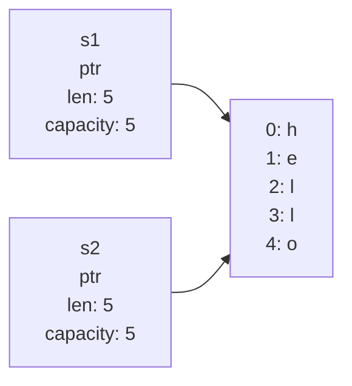
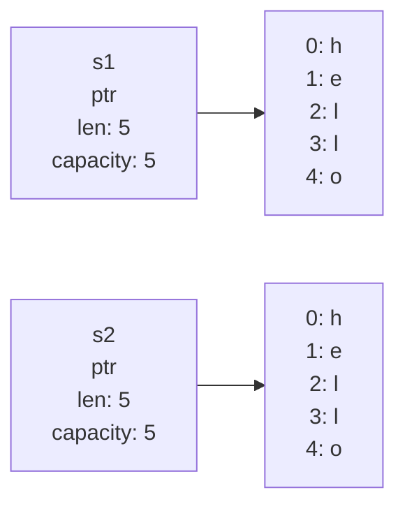
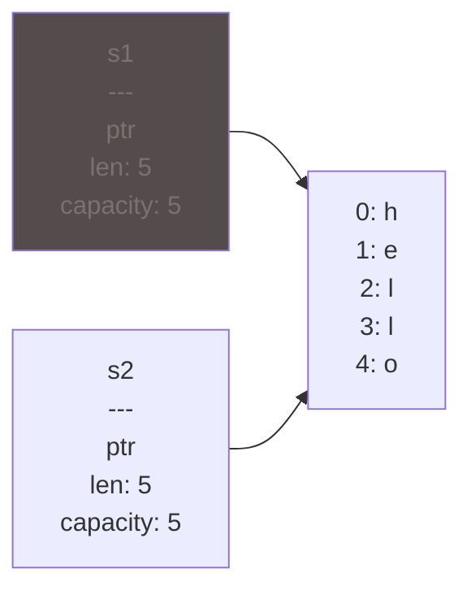
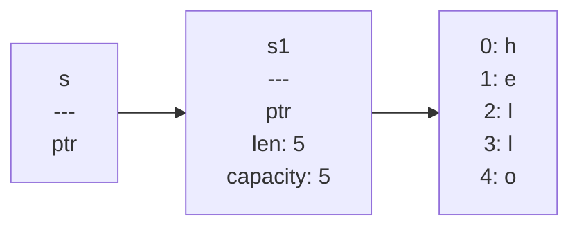

# 04. Владение и заимствование

---

# Владение (Ownership)

- Каждое значение в Rust имеет владельца.
- Одновременно может быть только один владелец.
- Когда владелец выходит за пределы области действия, значение будет очищено.

---

# Пример работы владения

````md magic-move
```rs
let s = "hello";
```

```rs
{                      // s не ещё не инициализированна
        let s = "hello";   // s доступна, начиная с этой строки

        // операции с s
}    // Область видимости закончилась и переменная s больше не существует
```
````

---
layout: intro
---

# Стек и куча

---

# Стек
````md magic-move
```rs
fn main() {
    let x = 42;
}
```

```rs
fn foo() {
    let y = 5;
    let z = 100;
}

fn main() {
    let x = 42;

    foo();
}

// Address  Name    Value
// 0        x       42

// Address  Name    Value
// 2        z       100
// 1        y       5
// 0        x       42

// Address  Name    Value
// 0        x       42
```
````
---

# Куча

```rs
fn main() {
    let x = Box::new(5);
    let y = 42;
}

// Address  Name    Value
// 1        y       42
// 0        x       ??????

// Address      Name    Value
// (230) - 1            5
// ...          ...     ...
// 1            y       42
// 0            x       → (230) - 1
```


---

# Строковый тип

````md magic-move
```rs
let s = String::from("hello");
```
```rs
// Вызов функции from из пространства имен String
let s = String::from("hello");
```
```rs
let mut s = String::from("hello");

s.push_str(", world!"); // push_str() добавляет литералы к строке

println!("{s}"); // Выведет `hello, world!`
```
````

<v-click v-click>

- Строковые литералы неизменяемы и хранятся в стеке.

- Строки являются сложной структурой, которая хранится в куче.
</v-click>

---

# Перемещение (move)

````md magic-move
```rs
let x = 5;
let y = x;
```

```rs
let s1 = String::from("hello");
let s2 = s1;
```
````

<v-switch>
<template #1>



</template>

<template #2>


</template>

<template #3>



</template>
</v-switch>

---

# Copy и Clone

````md magic-move
```rs
// Copy
let x = 5;
let y = x;

println!("x = {x}, y = {y}");
```

```rs
// Clone
let s1 = String::from("hello");
let s2 = s1.clone();

println!("s1 = {s1}, s2 = {s2}");
```
````

<v-click>

- Все целочисленные типы, такие как ```u32```.

- Булевый тип, ```bool```, со значениями ```true``` и ```false```.

- Все типы с плавающей точкой, например ```f64```.

- Тип символа, ```char```.

- Кортежи, если они содержат только типы, которые также реализуют ```Copy```. Например, ```(i32, i32)``` реализует ```Copy```, а ```(i32, String)``` - нет.

</v-click>

---

# Владение (Ownership) и функции

````md magic-move
```rs
fn main() {
  let s = String::from("hello");  // s появляется в области видимости main

  takes_ownership(s);             // s перемещается в область видимости
                                  // функции takes_ownership и пропадает из
                                  // области видимости main

  let x = 5;                      // x появляется в области видимости main

  makes_copy(x);                  // x перемещается в область, но i32
                                  // реализует Copy, что позволяет
                                  // использовать x в области видимости main

} // x выходит из области видимости, затем s. S была перемещена - ничего
  // особенного не происходит
```

```rs

fn takes_ownership(some_string: String) { // Строка появляется в области
                                          // видимости
    println!("{some_string}");
} // Здесь строка some_string выходит из области видимости и память очищается

fn makes_copy(some_integer: i32) { // целое число входит в область видимости
    println!("{some_integer}");
}
```
````

---

# Владение (Ownership) и возращение из функции

````md magic-move
```rs
fn main() {
    let s1 = gives_ownership();         // gives_ownership перемещает
                                        // результат в переменную s1

    let s2 = String::from("hello");     // s2 появляется в области видимости

    let s3 = takes_and_gives_back(s2);  // s2 перемещается в
                                        // takes_and_gives_back, которая
                                        // возращает значение в s3
} // Здесь s3 выходит из области и пропадает. s2 была перемещена, поэтому
  // ничего особенного не происходит. s1 выходит из области и пропадает.

```

```rs

fn gives_ownership() -> String {             // gives_ownership перемещает
                                             // возврат в область той функции,
                                             // в которой была вызвана

    let some_string = String::from("yours"); // some_string появляется
                                             // в области

    some_string                              // some_string возвращается и
                                             // перемещает значение в область
                                             // той функции, в которой была
                                             // вызвана
}

// Функция принимает и возращает строку
fn takes_and_gives_back(a_string: String) -> String { // a_string появляется
                                                      // в области

    a_string  // a_string возвращается и перемещается в область той функции,
              // в которой была вызвана
}
```
````

---

# Ссылки (reference) и заимствование (borrowing)

<v-switch>
<template #0>

```rs
fn main() {
    let s1 = String::from("hello");

    let len = calculate_length(&s1);

    println!("Длина '{s1}': {len}.");
}

fn calculate_length(s: &String) -> usize {
    s.len()
}
```

</template>

<template #1>



</template>

<template #2>
```rs
fn calculate_length(s: &String) -> usize { // s ссылка на строку
    s.len()
} // Здесь, s выходит из области видимости. Из-за того, что calculate_length
  // не владеет s, она не очищает память.
```
</template>
</v-switch>
---

# Мутабельные ссылки

````md magic-move
```rs
fn main() {
    let s = String::from("hello");

    change(&s);
}

fn change(some_string: &String) {
    some_string.push_str(", world"); // Ошибка
}
```

```rs
fn main() {
    let mut s = String::from("hello");

    change(&mut s);
}

fn change(some_string: &mut String) {
    some_string.push_str(", world");
}
```

```rs
// Мутабельная ссылка на значение может быть только одна
let mut s = String::from("hello");

let r1 = &mut s;
let r2 = &mut s;

println!("{}, {}", r1, r2);
```

```rs
let mut s = String::from("hello");

{
    let r1 = &mut s;
} // r1 вышла из области видимости - можно создавать новую мутабельную ссылку

let r2 = &mut s;
```

```rs
// Одновременное хранение иммутабельных и мутабельных ссылок
let mut s = String::from("hello");

let r1 = &s; // проблем нет
let r2 = &s; // проблем нет
let r3 = &mut s; // Проблема

println!("{}, {}, and {}", r1, r2, r3);
```
````

---

# Висячие указатели (dangling pointers)

````md magic-move
```rs
fn main() {
    let reference_to_nothing = dangle();
}

fn dangle() -> &String {
    let s = String::from("hello");

    &s
}
```

```rs
fn dangle() -> &String { // dangle возвращает ссылку

    let s = String::from("hello"); // s - новая строка

    &s // возврат ссылки на s
} // Здесь s выходит из области видимости и пропадает. Память очищается
```

```rs
// Решение
fn no_dangle() -> String {
    let s = String::from("hello");

    s
}
```
````

---

# Vector

````md magic-move
```rs
let v: Vec<i32> = Vec::new();
```

```rs
let v = vec![1, 2, 3];
```

```rs
let mut v = Vec::new();

v.push(5);
v.push(6);
v.push(7);
v.push(8);
```

```rs
let v = vec![1, 2, 3, 4, 5];

let third: &i32 = &v[2];
println!("Третий элемент {third}");

let third: Option<&i32> = v.get(2);
match third {
    Some(third) => println!("Третий элемент {third}"),
    None => println!("Третьего элемента нет."),
}
```

```rs
let v = vec![100, 32, 57];

for i in &v {
    println!("{i}");
}
```

```rs
let mut v = vec![100, 32, 57];

for i in &mut v {
    *i += 50;
}
```
````
