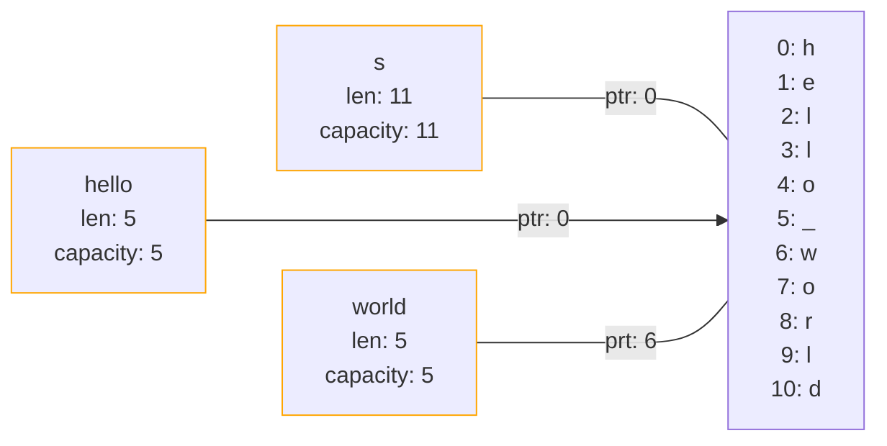

# 08. Slices

---

# slice

Слайсы в **Rust** - это ссылки на последовательные элементы в памяти, позволяющие ссылаться на части коллекции без копирования всех данных

<v-click>
```rs
&[T]
```

```&``` - указывает, что это ссылка.

```T``` - тип данных, на который ссылается ссылка.
</v-click>

---

# slice

```rs{*|1|3|4|*}
let s = String::from("hello world");

let hello = &s[0..5];
let world = &s[6..11];
```



---

# range и slice

````md magic-move

```rs{*|4-5}
// срез от начала
let s = String::from("hello");

let slice = &s[0..2];
let slice = &s[..2];
```

```rs{*|6-7}
// срез до конца
let s = String::from("hello");

let len = s.len();

let slice = &s[3..len];
let slice = &s[3..];
```

```rs{*|6-7}
// срез всех индексов
let s = String::from("hello");

let len = s.len();

let slice = &s[0..len];
let slice = &s[..];
```
````

---

# Slice и другие типы данных

````md magic-move
```rs
let a = [1, 2, 3, 4, 5];
```

```rs
let a = [1, 2, 3, 4, 5];

println!("{:?}", a[..]) // [1, 2, 3, 4, 5, 6, 7, 8]
println!("{:?}", a[..3]) // [1, 2, 3 ]
println!("{:?}", a[..=3]) // [1, 2, 3, 4]
println!("{:?}", a[1..]) // [2, 3, 4, 5, 6, 7, 8]
println!("{:?}", a[1..3]) // [2, 3]
println!("{:?}", a[1..=3]) // [2, 3, 4]
```
````

---

# Преимущества использования slice

````md magic-move
```rs{*|1|6|7|8|*}
fn slice_with_str(str: &str) {/* ... */}

fn main() {
    let a = String::from("hello world");

    slice_with_str(&a);
    slice_with_str(&a[..a.len() / 2]);
    slice_with_str("Hello world");
}
```

```rs{*|1|6|7|8|*}
fn slice_with_number(numbers: &[i32]) {/* ... */}

fn main() {
    let a = vec![1, 2, 3];

    slice_with_number(&a);
    slice_with_number(&a[..]);
    slice_with_number(&[1, 2, 3]);
}
```
````
